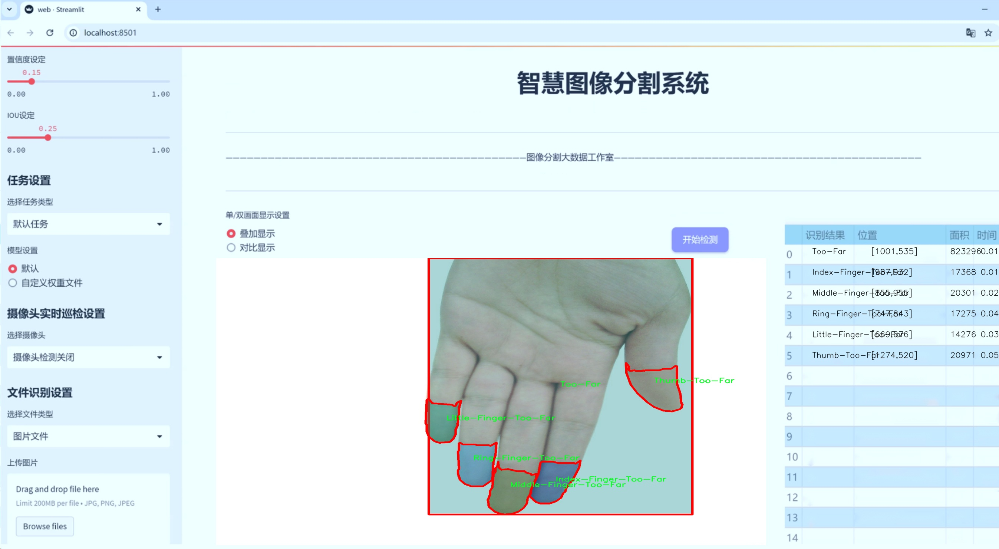

# 手指姿态指纹区域图像分割系统： yolov8-seg

### 1.研究背景与意义

[参考博客](https://gitee.com/YOLOv8_YOLOv11_Segmentation_Studio/projects)

[博客来源](https://kdocs.cn/l/cszuIiCKVNis)

研究背景与意义

随着人工智能技术的迅猛发展，计算机视觉领域的应用逐渐深入到各个行业，尤其是在手势识别和指纹识别等领域。手指姿态的识别不仅在智能交互、虚拟现实、增强现实等应用中扮演着重要角色，还在生物识别技术中具有广泛的应用前景。手指姿态的准确识别能够有效提升人机交互的自然性和流畅性，同时为安全认证提供更加可靠的手段。近年来，YOLO（You Only Look Once）系列模型因其高效的实时检测能力而受到广泛关注，尤其是YOLOv8在目标检测精度和速度上的显著提升，使其成为研究手指姿态识别的理想选择。

本研究旨在基于改进的YOLOv8模型，构建一个高效的手指姿态指纹区域图像分割系统。通过对FarHand Segmentation数据集的深入分析与应用，我们将探索如何利用该数据集中的1500幅图像，涵盖12个类别的手指姿态，来提升手指姿态识别的准确性和鲁棒性。数据集中包括了不同手指的多种姿态，如“Perfect”和“Too-Far”等分类，能够为模型提供丰富的训练样本，进而增强模型对手指姿态变化的适应能力。

在手指姿态识别的研究中，图像分割技术是实现高精度识别的关键。通过对手指区域的精确分割，模型能够更好地理解手指的形状、位置和姿态，从而提升后续识别任务的准确性。改进YOLOv8模型的引入，将有助于提高分割的精度和速度，满足实时应用的需求。此外，针对数据集中不同类别的手指姿态，模型的改进将集中在增强对“Too-Far”类别的识别能力，以应对手指与摄像头距离变化带来的挑战。

本研究的意义不仅在于技术层面的创新，更在于推动手指姿态识别技术的实际应用。随着智能设备的普及，用户对自然交互方式的需求日益增加，手指姿态识别技术的进步将为智能家居、智能穿戴设备等领域提供更加便捷的交互方式。同时，结合指纹识别技术，能够为安全认证提供多重保障，提升用户体验和安全性。

综上所述，基于改进YOLOv8的手指姿态指纹区域图像分割系统的研究，不仅具有重要的学术价值，也为实际应用提供了广阔的前景。通过深入分析和优化手指姿态识别技术，我们期待能够在未来的研究中实现更高的识别精度和更强的系统鲁棒性，为人机交互和生物识别领域的发展贡献新的力量。

### 2.图片演示





注意：本项目提供完整的训练源码数据集和训练教程,由于此博客编辑较早,暂不提供权重文件（best.pt）,需要按照6.训练教程进行训练后实现上图效果。

### 3.视频演示

[3.1 视频演示](https://www.bilibili.com/video/BV163mmYoEFY/)

### 4.数据集信息

##### 4.1 数据集类别数＆类别名

nc: 12
names: ['Index-Finger-Perfect', 'Index-Finger-Too-Far', 'Little-Finger-Perfect', 'Little-Finger-Too-Far', 'Middle-Finger-Perfect', 'Middle-Finger-Too-Far', 'Perfect', 'Ring-Finger-Perfect', 'Ring-Finger-Too-Far', 'Thumb-Perfect', 'Thumb-Too-Far', 'Too-Far']


##### 4.2 数据集信息简介

数据集信息展示

在本研究中，我们采用了名为“FarHand Segmentation”的数据集，以训练和改进YOLOv8-seg手指姿态指纹区域图像分割系统。该数据集专注于手指姿态的细致分割，旨在提升指纹识别和手势识别的准确性和鲁棒性。数据集的设计充分考虑了不同手指在不同距离下的表现，提供了丰富的样本，以便于模型学习和适应各种手指姿态。

“FarHand Segmentation”数据集包含12个类别，涵盖了不同手指的多种状态。这些类别具体包括：完美的食指（Index-Finger-Perfect）、距离过远的食指（Index-Finger-Too-Far）、完美的小指（Little-Finger-Perfect）、距离过远的小指（Little-Finger-Too-Far）、完美的中指（Middle-Finger-Perfect）、距离过远的中指（Middle-Finger-Too-Far）、完美的手指（Perfect）、完美的无名指（Ring-Finger-Perfect）、距离过远的无名指（Ring-Finger-Too-Far）、完美的拇指（Thumb-Perfect）、距离过远的拇指（Thumb-Too-Far）以及“过远”（Too-Far）这一类别。这些类别的划分不仅考虑了手指的种类，还细致地反映了手指与摄像头之间的距离变化，确保了数据集的多样性和全面性。

数据集中的图像样本均经过精心标注，确保每个类别的特征能够被清晰地识别和学习。通过引入不同的手指姿态和距离变化，数据集为YOLOv8-seg模型提供了丰富的训练数据，使其能够在复杂的环境中进行有效的手指姿态分割。这种多样性对于提高模型的泛化能力至关重要，尤其是在实际应用中，手指的姿态和距离往往是变化多端的。

在数据集的构建过程中，研究团队采用了多种图像采集技术，以确保数据的真实性和代表性。样本来源于不同的用户，涵盖了各种手指的自然姿态，确保了数据集的广泛适用性。此外，数据集还包含了多种光照条件和背景环境，以增强模型在不同场景下的适应能力。这种多样化的训练数据将有助于提升YOLOv8-seg模型在实际应用中的表现，尤其是在手指姿态识别和指纹识别等领域。

总之，“FarHand Segmentation”数据集为改进YOLOv8-seg手指姿态指纹区域图像分割系统提供了坚实的基础。通过对12个类别的细致划分和丰富的样本数据，研究团队期望能够显著提升模型的分割精度和识别能力，从而推动手指姿态识别技术的发展。随着这一领域的不断进步，未来的应用前景将更加广阔，为人机交互、智能识别等技术的实现提供强有力的支持。


### 5.项目依赖环境部署教程（零基础手把手教学）

[5.1 环境部署教程链接（零基础手把手教学）](https://www.bilibili.com/video/BV1jG4Ve4E9t/?vd_source=bc9aec86d164b67a7004b996143742dc)


[5.2 安装Python虚拟环境创建和依赖库安装视频教程链接（零基础手把手教学）](https://www.bilibili.com/video/BV1nA4VeYEze/?vd_source=bc9aec86d164b67a7004b996143742dc)

### 6.手把手YOLOV8-seg训练视频教程（零基础手把手教学）

[6.1 手把手YOLOV8-seg训练视频教程（零基础小白有手就能学会）](https://www.bilibili.com/video/BV1cA4VeYETe/?vd_source=bc9aec86d164b67a7004b996143742dc)


按照上面的训练视频教程链接加载项目提供的数据集，运行train.py即可开始训练



     Epoch   gpu_mem       box       obj       cls    labels  img_size
     1/200     0G   0.01576   0.01955  0.007536        22      1280: 100%|██████████| 849/849 [14:42<00:00,  1.04s/it]
               Class     Images     Labels          P          R     mAP@.5 mAP@.5:.95: 100%|██████████| 213/213 [01:14<00:00,  2.87it/s]
                 all       3395      17314      0.994      0.957      0.0957      0.0843

     Epoch   gpu_mem       box       obj       cls    labels  img_size
     2/200     0G   0.01578   0.01923  0.007006        22      1280: 100%|██████████| 849/849 [14:44<00:00,  1.04s/it]
               Class     Images     Labels          P          R     mAP@.5 mAP@.5:.95: 100%|██████████| 213/213 [01:12<00:00,  2.95it/s]
                 all       3395      17314      0.996      0.956      0.0957      0.0845

     Epoch   gpu_mem       box       obj       cls    labels  img_size
     3/200     0G   0.01561    0.0191  0.006895        27      1280: 100%|██████████| 849/849 [10:56<00:00,  1.29it/s]
               Class     Images     Labels          P          R     mAP@.5 mAP@.5:.95: 100%|███████   | 187/213 [00:52<00:00,  4.04it/s]
                 all       3395      17314      0.996      0.957      0.0957      0.0845


### 7.50+种全套YOLOV8-seg创新点加载调参实验视频教程（一键加载写好的改进模型的配置文件）

[7.1 50+种全套YOLOV8-seg创新点加载调参实验视频教程（一键加载写好的改进模型的配置文件）](https://www.bilibili.com/video/BV1Hw4VePEXv/?vd_source=bc9aec86d164b67a7004b996143742dc)

### YOLOV8-seg算法简介

原始YOLOv8-seg算法原理

YOLOv8-seg算法是YOLO系列模型中的最新版本，专注于目标检测与实例分割任务，展现出卓越的性能和高效的计算能力。作为YOLOv5的继承者，YOLOv8在结构上进行了多项优化，尤其是在轻量化设计方面，致力于在保证精度的同时降低计算资源的消耗。该算法的核心在于其独特的网络架构，主要由骨干特征提取网络、特征融合层和检测头层组成。

在骨干特征提取网络中，YOLOv8采用了C2F模块来替代原有的C3模块。C2F模块的设计理念是通过引入更多的跳层连接和分割操作，增强特征提取的能力。与传统的卷积操作相比，YOLOv8将卷积核的大小从6x6缩小至3x3，极大地提升了特征提取的细腻度与效率。此外，C2F模块的深度设置为3、6、6、3，进一步优化了网络的层次结构，使得特征提取更加高效。

特征融合层是YOLOv8-seg算法的另一重要组成部分。该层结合了特征金字塔网络（FPN）和路径聚合网络（PAN），通过双向跨尺度连接实现特征的高效融合。为进一步提升模型对不同尺度特征信息的提取速度，YOLOv8引入了BiFPN网络。BiFPN的设计使得特征融合过程更加灵活和高效，通过加权特征融合策略，能够有效整合来自不同层次的特征信息，从而提高模型在复杂场景下的表现。

在检测头层，YOLOv8-seg算法采用了轻量化的解耦头，取代了传统的耦合头。这一变化不仅简化了模型结构，还使得目标检测的过程更加高效。YOLOv8-seg采用了无锚点检测策略，去除了以往模型中对锚框的依赖，转而通过解耦的分类和回归分支进行目标检测。这种设计使得模型在处理多种目标时，能够更好地适应不同的形状和尺寸，提高了检测的准确性。

YOLOv8-seg算法的创新还体现在其损失函数的设计上。通过引入变焦损失、数据平均保真度损失和完美交并比损失，YOLOv8-seg能够更加精准地计算分类和边界框的损失。这种新的损失策略使得模型在训练过程中能够更好地捕捉目标的特征，进而提升检测的精度。

此外，YOLOv8-seg在处理小目标和高分辨率图像方面表现出色。这一特性使得该算法在实际应用中具有广泛的适用性，尤其是在复杂环境下的目标检测与分割任务中。YOLOv8的设计理念不仅关注于模型的精度与速度，还考虑到了工程化的简洁性与易用性，使得研究人员和开发者能够更方便地将其应用于各种实际场景。

在实际应用中，YOLOv8-seg算法的高效性和准确性使其成为垃圾分类、交通监控、医疗影像分析等领域的理想选择。通过对模型的不断优化与改进，YOLOv8-seg在目标检测与实例分割的任务中展现出强大的能力，成为计算机视觉领域中的一颗璀璨明珠。

综上所述，YOLOv8-seg算法通过轻量化的网络结构、创新的特征融合策略、无锚点检测方法以及先进的损失函数设计，成功实现了在高效性与准确性之间的平衡。随着计算机视觉技术的不断发展，YOLOv8-seg无疑将在未来的研究与应用中发挥更加重要的作用。


### 9.系统功能展示（检测对象为举例，实际内容以本项目数据集为准）

图9.1.系统支持检测结果表格显示

  图9.2.系统支持置信度和IOU阈值手动调节

  图9.3.系统支持自定义加载权重文件best.pt(需要你通过步骤5中训练获得)

  图9.4.系统支持摄像头实时识别

  图9.5.系统支持图片识别

  图9.6.系统支持视频识别

  图9.7.系统支持识别结果文件自动保存

  图9.8.系统支持Excel导出检测结果数据


### 10.50+种全套YOLOV8-seg创新点原理讲解（非科班也可以轻松写刊发刊，V11版本正在科研待更新）

#### 10.1 由于篇幅限制，每个创新点的具体原理讲解就不一一展开，具体见下列网址中的创新点对应子项目的技术原理博客网址【Blog】：


[10.1 50+种全套YOLOV8-seg创新点原理讲解链接](https://gitee.com/qunmasj/good)

#### 10.2 部分改进模块原理讲解(完整的改进原理见上图和技术博客链接)【如果此小节的图加载失败可以通过CSDN或者Github搜索该博客的标题访问原始博客，原始博客图片显示正常】
### YOLOv8简介
YOLOv8 尚未发表论文，因此我们无法直接了解其创建过程中进行的直接研究方法和消融研究。话虽如此，我们分析了有关模型的存储库和可用信息，以开始记录 YOLOv8 中的新功能。

如果您想自己查看代码，请查看YOLOv8 存储库并查看此代码差异以了解一些研究是如何完成的。

在这里，我们提供了有影响力的模型更新的快速总结，然后我们将查看模型的评估，这不言自明。

GitHub 用户 RangeKing 制作的下图显示了网络架构的详细可视化。


在这里插入图片描述


在这里插入图片描述

YOLOv8 架构，GitHub 用户 RangeKing 制作的可视化

无锚检测
YOLOv8 是一个无锚模型。这意味着它直接预测对象的中心而不是已知锚框的偏移量。


YOLO中anchor box的可视化

锚框是早期 YOLO 模型中众所周知的棘手部分，因为它们可能代表目标基准框的分布，而不是自定义数据集的分布。


YOLOv8 的检测头，在netron.app中可视化

Anchor free 检测减少了框预测的数量，从而加速了非最大抑制 (NMS)，这是一个复杂的后处理步骤，在推理后筛选候选检测。


YOLOv8 的检测头，在netron.app中可视化

新的卷积
stem 的第一个6x6conv 被替换为 a 3x3，主要构建块被更改，并且C2f替换了C3。该模块总结如下图，其中“f”是特征数，“e”是扩展率，CBS是由a Conv、a BatchNorm、a组成的block SiLU。

在中， （两个具有剩余连接的 3x3C2f的奇特名称）的所有输出都被连接起来。而在仅使用最后一个输出。Bottleneck``convs``C3``Bottleneck


新的 YOLOv8C2f模块

这Bottleneck与 YOLOv5 中的相同，但第一个 conv 的内核大小从更改1x1为3x3. 从这些信息中，我们可以看到 YOLOv8 开始恢复到 2015 年定义的 ResNet 块。

在颈部，特征直接连接而不强制使用相同的通道尺寸。这减少了参数数量和张量的整体大小。

### 空间和通道重建卷积SCConv
参考该博客提出的一种高效的卷积模块，称为SCConv (spatial and channel reconstruction convolution)，以减少冗余计算并促进代表性特征的学习。提出的SCConv由空间重构单元(SRU)和信道重构单元(CRU)两个单元组成。

（1）SRU根据权重分离冗余特征并进行重构，以抑制空间维度上的冗余，增强特征的表征。

（2）CRU采用分裂变换和融合策略来减少信道维度的冗余以及计算成本和存储。

（3）SCConv是一种即插即用的架构单元，可直接用于替代各种卷积神经网络中的标准卷积。实验结果表明，scconvo嵌入模型能够通过减少冗余特征来获得更好的性能，并且显著降低了复杂度和计算成本。


SCConv如图所示，它由两个单元组成，空间重建单元(SRU)和通道重建单元(CRU)，以顺序的方式放置。具体而言，对于瓶颈残差块中的中间输入特征X，首先通过SRU运算获得空间细化特征Xw，然后利用CRU运算获得信道细化特征Y。SCConv模块充分利用了特征之间的空间冗余和通道冗余，可以无缝集成到任何CNN架构中，以减少中间特征映射之间的冗余并增强CNN的特征表示。

#### SRU单元用于空间冗余


为了利用特征的空间冗余，引入了空间重构单元(SRU)，如图2所示，它利用了分离和重构操作。

分离操作 的目的是将信息丰富的特征图与空间内容对应的信息较少的特征图分离开来。我们利用组归一化(GN)层中的比例因子来评估不同特征图的信息内容。具体来说，给定一个中间特征映射X∈R N×C×H×W，首先通过减去平均值µ并除以标准差σ来标准化输入特征X，如下所示:


其中µ和σ是X的均值和标准差，ε是为了除法稳定性而加入的一个小的正常数，γ和β是可训练的仿射变换。

GN层中的可训练参数\gamma \in R^{C}用于测量每个批次和通道的空间像素方差。更丰富的空间信息反映了空间像素的更多变化，从而导致更大的γ。归一化相关权重W_{\gamma} \in R^{C}由下面公式2得到，表示不同特征映射的重要性。


然后将经Wγ重新加权的特征映射的权值通过sigmoid函数映射到(0,1)范围，并通过阈值进行门控。我们将阈值以上的权重设置为1，得到信息权重W1，将其设置为0，得到非信息权重W2(实验中阈值设置为0.5)。获取W的整个过程可以用公式表示。


最后将输入特征X分别乘以W1和W2，得到两个加权特征:信息量较大的特征X_{1}^{\omega }和信息量较小的特征X_{2}^{\omega }。这样就成功地将输入特征分为两部分:X_{1}^{\omega }具有信息量和表达性的空间内容，而X_{2}^{\omega }几乎没有信息，被认为是冗余的。

重构操作 将信息丰富的特征与信息较少的特征相加，生成信息更丰富的特征，从而节省空间空间。采用交叉重构运算，将加权后的两个不同的信息特征充分结合起来，加强它们之间的信息流。然后将交叉重构的特征X^{\omega1}和X^{\omega2}进行拼接，得到空间精细特征映射X^{\omega}。从后过程表示如下：


其中⊗是逐元素的乘法，⊕是逐元素的求和，∪是串联。将SRU应用于中间输入特征X后，不仅将信息特征与信息较少的特征分离，而且对其进行重构，增强代表性特征，抑制空间维度上的冗余特征。然而，空间精细特征映射X^{\omega}在通道维度上仍然是冗余的。

#### CRU单元用于通道冗余


分割 操作将输入的空间细化特征X^{\omega}分割成两个部分，一部分通道数是\alpha C，另一部分通道数是(1-\alpha) C，随后对两组特征的通道数使用1 * 1卷积核进行压缩，分别得到X_{up}和X_{low}。

转换 操作将输入的X_{up}作为“富特征提取”的输入，分别进行GWC和PWC，然后相加得到输出Y1，将输入X_{low}作为“富特征提取”的补充，进行PWC，得到的记过和原来的输入取并集得到Y2。

融合 操作使用简化的SKNet方法来自适应合并Y1和Y2。具体说是首先使用全局平均池化将全局空间信息和通道统计信息结合起来，得到经过池化的S1和S2。然后对S1和S2做Softmax得到特征权重向量\beta _{1}和\beta _{2}，最后使用特征权重向量得到输出Y = \beta _{1}*Y_{1} + \beta _{2}*Y_{2}，Y即为通道提炼的特征。


### 11.项目核心源码讲解（再也不用担心看不懂代码逻辑）

#### 11.1 ultralytics\utils\dist.py

以下是对给定代码的核心部分进行提炼和详细注释的结果：

```python
# 导入必要的库
import os
import re
import shutil
import socket
import sys
import tempfile
from pathlib import Path

from . import USER_CONFIG_DIR  # 导入用户配置目录
from .torch_utils import TORCH_1_9  # 导入PyTorch版本信息

def find_free_network_port() -> int:
    """
    查找本地主机上可用的网络端口。

    在单节点训练时，避免连接到真实的主节点，但需要设置
    `MASTER_PORT` 环境变量时非常有用。
    """
    with socket.socket(socket.AF_INET, socket.SOCK_STREAM) as s:
        s.bind(('127.0.0.1', 0))  # 绑定到本地地址和随机端口
        return s.getsockname()[1]  # 返回分配的端口号


def generate_ddp_file(trainer):
    """生成一个DDP文件并返回其文件名。"""
    # 获取训练器的模块和类名
    module, name = f'{trainer.__class__.__module__}.{trainer.__class__.__name__}'.rsplit('.', 1)

    # 构建文件内容
    content = f'''overrides = {vars(trainer.args)} \nif __name__ == "__main__":
    from {module} import {name}
    from ultralytics.utils import DEFAULT_CFG_DICT

    cfg = DEFAULT_CFG_DICT.copy()
    cfg.update(save_dir='')   # 处理额外的键 'save_dir'
    trainer = {name}(cfg=cfg, overrides=overrides)
    trainer.train()'''
    
    # 创建DDP目录（如果不存在）
    (USER_CONFIG_DIR / 'DDP').mkdir(exist_ok=True)
    
    # 创建临时文件并写入内容
    with tempfile.NamedTemporaryFile(prefix='_temp_',
                                     suffix=f'{id(trainer)}.py',
                                     mode='w+',
                                     encoding='utf-8',
                                     dir=USER_CONFIG_DIR / 'DDP',
                                     delete=False) as file:
        file.write(content)  # 写入内容到临时文件
    return file.name  # 返回临时文件名


def generate_ddp_command(world_size, trainer):
    """生成并返回用于分布式训练的命令。"""
    import __main__  # 本地导入以避免某些问题
    if not trainer.resume:
        shutil.rmtree(trainer.save_dir)  # 如果不恢复训练，删除保存目录
    
    file = str(Path(sys.argv[0]).resolve())  # 获取当前脚本的绝对路径
    # 定义安全的文件名模式
    safe_pattern = re.compile(r'^[a-zA-Z0-9_. /\\-]{1,128}$')
    
    # 检查文件名是否安全且存在
    if not (safe_pattern.match(file) and Path(file).exists() and file.endswith('.py')):
        file = generate_ddp_file(trainer)  # 生成DDP文件
    
    # 选择分布式命令
    dist_cmd = 'torch.distributed.run' if TORCH_1_9 else 'torch.distributed.launch'
    port = find_free_network_port()  # 查找可用端口
    # 构建命令列表
    cmd = [sys.executable, '-m', dist_cmd, '--nproc_per_node', f'{world_size}', '--master_port', f'{port}', file]
    return cmd, file  # 返回命令和文件名


def ddp_cleanup(trainer, file):
    """如果创建了临时文件，则删除它。"""
    if f'{id(trainer)}.py' in file:  # 检查文件名中是否包含临时文件后缀
        os.remove(file)  # 删除临时文件
```

### 代码核心部分分析：
1. **查找可用端口**：`find_free_network_port` 函数用于查找本地主机上可用的网络端口，确保在分布式训练时不会发生端口冲突。
   
2. **生成DDP文件**：`generate_ddp_file` 函数生成一个临时的Python文件，用于分布式数据并行（DDP）训练。该文件包含训练器的配置和训练逻辑。

3. **生成分布式命令**：`generate_ddp_command` 函数构建执行分布式训练所需的命令，包括使用的脚本、进程数和端口号。

4. **清理临时文件**：`ddp_cleanup` 函数用于在训练结束后删除生成的临时文件，保持文件系统的整洁。

这些函数共同支持Ultralytics YOLO的分布式训练功能，确保训练过程的灵活性和高效性。

这个文件是Ultralytics YOLO项目中的一个模块，主要用于处理分布式训练相关的功能。文件中包含了几个重要的函数，分别用于查找可用的网络端口、生成分布式数据并行（DDP）文件、生成分布式训练命令以及清理临时文件。

首先，`find_free_network_port`函数用于查找本地主机上一个可用的网络端口。这个功能在单节点训练时非常有用，因为我们不需要连接到真实的主节点，但仍然需要设置`MASTER_PORT`环境变量。函数通过创建一个TCP套接字并绑定到本地地址的随机端口来实现这一点，最后返回这个端口号。

接下来，`generate_ddp_file`函数用于生成一个DDP文件并返回其文件名。这个文件的内容包含了训练器的参数和训练逻辑。函数首先获取训练器的模块和类名，然后构建一个Python脚本的内容，最后将这个内容写入一个临时文件中，文件存储在用户配置目录下的`DDP`文件夹中。这个临时文件的命名是基于训练器的ID，以确保唯一性。

然后是`generate_ddp_command`函数，它生成并返回用于分布式训练的命令。该函数首先检查训练器是否需要恢复训练，如果不需要，则删除保存目录。接着，它会检查当前脚本的安全性，确保文件名符合特定的模式，并且文件存在且以`.py`结尾。如果不符合条件，则调用`generate_ddp_file`生成一个新的DDP文件。之后，函数会确定使用的分布式命令（根据PyTorch版本选择），并调用`find_free_network_port`获取一个可用的端口。最后，构建出完整的命令列表并返回。

最后，`ddp_cleanup`函数用于清理临时文件。如果在生成DDP文件时创建了临时文件，并且该文件名包含训练器的ID，则会将其删除，以避免在训练结束后留下不必要的文件。

总体来说，这个模块的主要功能是支持分布式训练的设置和管理，确保训练过程中的资源能够有效利用，并在训练结束后进行必要的清理。

#### 11.2 ultralytics\utils\patches.py

以下是代码中最核心的部分，并附上详细的中文注释：

```python
import cv2
import numpy as np
import torch

def imread(filename: str, flags: int = cv2.IMREAD_COLOR):
    """
    从文件中读取图像。

    参数:
        filename (str): 要读取的文件路径。
        flags (int, optional): 标志，可以取cv2.IMREAD_*的值。默认为cv2.IMREAD_COLOR。

    返回:
        (np.ndarray): 读取的图像。
    """
    # 使用cv2.imdecode读取图像，np.fromfile用于处理文件路径
    return cv2.imdecode(np.fromfile(filename, np.uint8), flags)


def imwrite(filename: str, img: np.ndarray, params=None):
    """
    将图像写入文件。

    参数:
        filename (str): 要写入的文件路径。
        img (np.ndarray): 要写入的图像。
        params (list of ints, optional): 额外参数。请参见OpenCV文档。

    返回:
        (bool): 如果文件写入成功则返回True，否则返回False。
    """
    try:
        # 使用cv2.imencode将图像编码并写入文件
        cv2.imencode(Path(filename).suffix, img, params)[1].tofile(filename)
        return True
    except Exception:
        return False


def imshow(winname: str, mat: np.ndarray):
    """
    在指定窗口中显示图像。

    参数:
        winname (str): 窗口的名称。
        mat (np.ndarray): 要显示的图像。
    """
    # 使用cv2.imshow显示图像，窗口名称进行编码以避免错误
    cv2.imshow(winname.encode('unicode_escape').decode(), mat)


def torch_save(*args, **kwargs):
    """
    使用dill（如果存在）序列化lambda函数，pickle无法处理的情况。

    参数:
        *args (tuple): 传递给torch.save的位置参数。
        **kwargs (dict): 传递给torch.save的关键字参数。
    """
    try:
        import dill as pickle  # 尝试导入dill库
    except ImportError:
        import pickle  # 如果没有dill，则使用pickle

    # 如果kwargs中没有'pickle_module'，则将其设置为pickle
    if 'pickle_module' not in kwargs:
        kwargs['pickle_module'] = pickle
    return torch.save(*args, **kwargs)  # 调用torch.save进行保存
```

### 代码说明：
1. **imread**: 该函数用于从指定路径读取图像，并返回一个NumPy数组格式的图像数据。使用`cv2.imdecode`结合`np.fromfile`可以处理文件路径中的特殊字符。
  
2. **imwrite**: 该函数用于将图像数据写入指定路径的文件中。它使用`cv2.imencode`进行图像编码，并将编码后的数据写入文件。若写入成功则返回True，失败则返回False。

3. **imshow**: 该函数用于在指定窗口中显示图像。窗口名称经过编码处理，以避免因字符编码问题导致的错误。

4. **torch_save**: 该函数扩展了PyTorch的保存功能，允许使用`dill`库来序列化lambda函数，这在某些情况下是`pickle`无法处理的。它会检查是否有`dill`库可用，并在必要时使用`pickle`。

这个程序文件 `ultralytics/utils/patches.py` 主要是对现有功能进行扩展和更新的“猴子补丁”实现。它包含了一些图像处理和序列化的功能，主要依赖于 OpenCV 和 PyTorch 库。

首先，文件导入了必要的库，包括 `Path`（用于处理文件路径）、`cv2`（OpenCV库，用于图像处理）、`numpy`（用于数值计算）和 `torch`（用于深度学习）。接下来，文件定义了一些函数，这些函数主要是对 OpenCV 和 PyTorch 的功能进行封装和增强。

在 OpenCV 部分，首先定义了一个 `_imshow` 变量，用于避免递归错误。接着，定义了 `imread` 函数，该函数用于从文件中读取图像。它接受文件名和标志参数，默认情况下以彩色模式读取图像。函数内部使用 `cv2.imdecode` 结合 `np.fromfile` 来读取图像数据。

然后是 `imwrite` 函数，用于将图像写入文件。它接受文件名、图像数据和可选的参数列表。函数尝试使用 `cv2.imencode` 将图像编码为指定格式，并使用 `tofile` 方法将其写入文件。如果成功写入，返回 `True`，否则返回 `False`。

接下来是 `imshow` 函数，用于在指定窗口中显示图像。它接受窗口名称和图像数据作为参数。该函数调用了之前定义的 `_imshow`，并对窗口名称进行了编码处理，以确保兼容多语言环境。

在 PyTorch 部分，首先定义了一个 `_torch_save` 变量，避免递归错误。然后定义了 `torch_save` 函数，该函数用于保存对象。与标准的 `torch.save` 不同，这个函数尝试使用 `dill` 库来序列化那些 `pickle` 无法处理的 lambda 函数。如果没有找到 `dill`，则使用标准的 `pickle`。函数确保在调用 `torch.save` 时传递正确的序列化模块。

总体来说，这个文件通过封装 OpenCV 和 PyTorch 的一些功能，提供了更灵活和多语言友好的图像处理和对象保存的接口，增强了原有库的功能。

#### 11.3 ultralytics\nn\modules\__init__.py

以下是代码中最核心的部分，并附上详细的中文注释：

```python
# 导入Ultralytics YOLO模块所需的各个组件
from .block import *       # 导入块（Block）相关的模块
from .conv import *        # 导入卷积（Conv）相关的模块
from .head import *        # 导入头部（Head）相关的模块
from .transformer import *  # 导入变换器（Transformer）相关的模块
```

### 详细注释：

1. **模块导入**：
   - `from .block import *`：从当前包中导入所有与“块”相关的模块。这些模块通常用于构建神经网络的基本构件。
   - `from .conv import *`：从当前包中导入所有与卷积操作相关的模块。卷积是深度学习中常用的操作，尤其是在图像处理任务中。
   - `from .head import *`：从当前包中导入所有与网络头部相关的模块。网络头部通常负责输出层的定义，处理最终的分类或回归任务。
   - `from .transformer import *`：从当前包中导入所有与变换器相关的模块。变换器通常用于处理序列数据，尤其是在自然语言处理和图像处理中的应用。

这些导入语句为后续构建和训练YOLO模型提供了必要的基础组件。

这个程序文件是Ultralytics YOLO项目中的一个模块初始化文件，遵循AGPL-3.0许可证。文件的主要功能是导入与神经网络相关的各种模块，以便在其他地方使用。

文件开头包含了一个文档字符串，简要介绍了该模块的用途，并提供了一个示例代码。示例代码展示了如何使用该模块中的功能来可视化一个神经网络模块。具体来说，代码首先导入了必要的库，包括`ultralytics.nn.modules`、`torch`和`os`。接着，创建了一个形状为(1, 128, 40, 40)的张量`x`，这个张量可以被视为一个批次的输入数据，通常用于卷积神经网络的输入。

然后，代码实例化了一个卷积层`Conv`，输入和输出通道数均为128。接下来，使用`torch.onnx.export`函数将这个卷积层导出为ONNX格式的模型文件，文件名为`m._get_name() + '.onnx'`。最后，使用`os.system`命令调用`onnxsim`工具对导出的ONNX模型进行简化，并打开生成的文件。

在文件的最后部分，使用了相对导入的方式，将多个模块导入到当前命名空间中，包括`block`、`conv`、`head`和`transformer`。这些模块可能包含了实现不同神经网络组件的类和函数，使得用户可以方便地构建和使用各种神经网络结构。

总的来说，这个文件是Ultralytics YOLO项目中神经网络模块的一个入口，提供了必要的导入和示例，方便用户进行模型的构建和可视化。

#### 11.4 ultralytics\models\sam\predict.py

以下是代码中最核心的部分，并附上详细的中文注释：

```python
class Predictor(BasePredictor):
    """
    Predictor类用于Segment Anything Model (SAM)，继承自BasePredictor。

    该类提供了一个用于图像分割任务的模型推理接口。
    通过先进的架构和可提示的分割能力，它实现了灵活和实时的掩膜生成。
    该类能够处理多种类型的提示，如边界框、点和低分辨率掩膜。
    """

    def __init__(self, cfg=DEFAULT_CFG, overrides=None, _callbacks=None):
        """
        初始化Predictor，配置、覆盖和回调。

        该方法设置Predictor对象，并应用任何提供的配置覆盖或回调。
        初始化SAM的任务特定设置，例如将retina_masks设置为True以获得最佳结果。

        Args:
            cfg (dict): 配置字典。
            overrides (dict, optional): 覆盖默认配置的值的字典。
            _callbacks (dict, optional): 自定义行为的回调函数字典。
        """
        if overrides is None:
            overrides = {}
        overrides.update(dict(task='segment', mode='predict', imgsz=1024))
        super().__init__(cfg, overrides, _callbacks)
        self.args.retina_masks = True  # 启用retina_masks
        self.im = None  # 输入图像
        self.features = None  # 提取的图像特征
        self.prompts = {}  # 存储提示信息
        self.segment_all = False  # 控制是否分割所有对象的标志

    def preprocess(self, im):
        """
        预处理输入图像以进行模型推理。

        该方法通过应用变换和归一化来准备输入图像。
        支持torch.Tensor和np.ndarray列表作为输入格式。

        Args:
            im (torch.Tensor | List[np.ndarray]): BCHW张量格式或HWC numpy数组列表。

        Returns:
            (torch.Tensor): 预处理后的图像张量。
        """
        if self.im is not None:
            return self.im  # 如果已经处理过，直接返回
        not_tensor = not isinstance(im, torch.Tensor)
        if not_tensor:
            im = np.stack(self.pre_transform(im))  # 预变换
            im = im[..., ::-1].transpose((0, 3, 1, 2))  # 转换为BCHW格式
            im = np.ascontiguousarray(im)
            im = torch.from_numpy(im)  # 转换为Tensor

        im = im.to(self.device)  # 移动到指定设备
        im = im.half() if self.model.fp16 else im.float()  # 根据模型精度选择数据类型
        if not_tensor:
            im = (im - self.mean) / self.std  # 归一化
        return im

    def inference(self, im, bboxes=None, points=None, labels=None, masks=None, multimask_output=False, *args, **kwargs):
        """
        基于给定的输入提示执行图像分割推理。

        该方法利用SAM的架构进行实时和可提示的分割任务。

        Args:
            im (torch.Tensor): 预处理后的输入图像张量，形状为(N, C, H, W)。
            bboxes (np.ndarray | List, optional): 边界框，形状为(N, 4)，XYXY格式。
            points (np.ndarray | List, optional): 指示对象位置的点，形状为(N, 2)，像素坐标。
            labels (np.ndarray | List, optional): 点提示的标签，形状为(N, )。1表示前景，0表示背景。
            masks (np.ndarray, optional): 先前预测的低分辨率掩膜，形状应为(N, H, W)。对于SAM，H=W=256。
            multimask_output (bool, optional): 返回多个掩膜的标志。对模糊提示有帮助。默认为False。

        Returns:
            (tuple): 包含以下三个元素的元组。
                - np.ndarray: 输出掩膜，形状为CxHxW，其中C是生成的掩膜数量。
                - np.ndarray: 长度为C的数组，包含模型为每个掩膜预测的质量分数。
                - np.ndarray: 形状为CxHxW的低分辨率logits，用于后续推理，H=W=256。
        """
        # 如果self.prompts中存储了提示，则覆盖提示
        bboxes = self.prompts.pop('bboxes', bboxes)
        points = self.prompts.pop('points', points)
        masks = self.prompts.pop('masks', masks)

        if all(i is None for i in [bboxes, points, masks]):
            return self.generate(im, *args, **kwargs)  # 如果没有提示，生成掩膜

        return self.prompt_inference(im, bboxes, points, labels, masks, multimask_output)  # 使用提示进行推理

    def generate(self, im, crop_n_layers=0, crop_overlap_ratio=512 / 1500, crop_downscale_factor=1,
                 points_stride=32, points_batch_size=64, conf_thres=0.88, stability_score_thresh=0.95,
                 stability_score_offset=0.95, crop_nms_thresh=0.7):
        """
        使用Segment Anything Model (SAM)执行图像分割。

        该函数将整个图像分割为组成部分，利用SAM的先进架构和实时性能能力。

        Args:
            im (torch.Tensor): 输入张量，表示预处理后的图像，维度为(N, C, H, W)。
            crop_n_layers (int): 指定用于图像裁剪的额外掩膜预测的层数。
            crop_overlap_ratio (float): 裁剪之间的重叠程度。
            points_stride (int, optional): 每侧采样的点数。
            points_batch_size (int): 同时处理的点的批量大小。
            conf_thres (float): 基于模型掩膜质量预测的过滤置信度阈值。
            stability_score_thresh (float): 基于掩膜稳定性的过滤阈值。
            crop_nms_thresh (float): 去除裁剪之间重复掩膜的IoU截止值。

        Returns:
            (tuple): 包含分割掩膜、置信度分数和边界框的元组。
        """
        self.segment_all = True  # 设置为分割所有对象
        ih, iw = im.shape[2:]  # 获取输入图像的高度和宽度
        crop_regions, layer_idxs = generate_crop_boxes((ih, iw), crop_n_layers, crop_overlap_ratio)  # 生成裁剪区域
        pred_masks, pred_scores, pred_bboxes = [], [], []  # 初始化预测结果

        for crop_region, layer_idx in zip(crop_regions, layer_idxs):
            x1, y1, x2, y2 = crop_region  # 获取裁剪区域的坐标
            crop_im = F.interpolate(im[..., y1:y2, x1:x2], (ih, iw), mode='bilinear', align_corners=False)  # 裁剪并插值
            # 进行推理并获取掩膜和分数
            crop_masks, crop_scores, crop_bboxes = self.prompt_inference(crop_im, multimask_output=True)

            # 进行后处理，去除重复掩膜
            keep = torchvision.ops.nms(crop_bboxes, crop_scores, crop_nms_thresh)  # 非极大值抑制
            pred_masks.append(crop_masks[keep])  # 存储最终掩膜
            pred_bboxes.append(crop_bboxes[keep])  # 存储最终边界框
            pred_scores.append(crop_scores[keep])  # 存储最终分数

        return torch.cat(pred_masks), torch.cat(pred_scores), torch.cat(pred_bboxes)  # 返回合并后的结果
```

### 代码核心部分说明：
1. **Predictor类**：这是实现图像分割的核心类，负责模型的初始化、图像预处理、推理和结果生成。
2. **预处理函数**：负责将输入图像转换为模型可以接受的格式，包括归一化和维度调整。
3. **推理函数**：根据输入的提示（如边界框、点等）执行图像分割，并返回生成的掩膜和分数。
4. **生成函数**：负责处理整个图像的分割，利用裁剪和非极大值抑制来提高分割精度。

以上代码是SAM模型在图像分割任务中的核心实现，包含了模型的初始化、输入处理、推理过程和结果生成的完整逻辑。

这个程序文件是Ultralytics框架中用于Segment Anything Model（SAM）进行图像分割预测的实现。该模型具有先进的图像分割能力，支持提示式分割和零样本性能，适用于高性能的实时图像分割任务。

文件首先导入了必要的库，包括NumPy、PyTorch和TorchVision等。接着，定义了一个`Predictor`类，继承自`BasePredictor`，用于处理图像分割的推理逻辑。该类提供了多种属性和方法，允许用户根据不同的输入提示（如边界框、点和低分辨率掩码）进行灵活的分割。

在`__init__`方法中，初始化了预测器的配置，包括任务类型、模式和图像大小等，并设置了一些默认值。`preprocess`方法负责对输入图像进行预处理，包括变换和归一化，以确保图像适合模型的输入格式。

`inference`方法是执行图像分割推理的核心，接受预处理后的图像和可选的提示信息（如边界框、点、标签和掩码），并调用`prompt_inference`方法进行基于提示的推理。如果没有提供提示，则调用`generate`方法对整个图像进行分割。

`prompt_inference`方法利用SAM的架构，处理输入的提示信息并生成分割掩码。它会将输入的边界框、点和掩码进行转换，并通过模型的编码器和解码器生成预测的掩码和分数。

`generate`方法则允许对整个图像进行分割，支持图像裁剪以提高分割精度。它会根据输入图像的尺寸和裁剪参数生成裁剪区域，并对每个裁剪区域进行分割，最后合并结果。

`setup_model`方法用于初始化SAM模型，配置设备和图像归一化参数。`postprocess`方法负责后处理模型的输出，将生成的掩码和边界框缩放到原始图像大小，并应用阈值过滤。

此外，`setup_source`和`set_image`方法用于配置数据源和设置待处理的图像。`set_prompts`方法允许用户提前设置提示信息，而`reset_image`方法则重置图像和特征。

最后，`remove_small_regions`方法用于对生成的分割掩码进行后处理，去除小的、孤立的区域，并执行非极大值抑制（NMS）以消除重复的边界框。

总体而言，这个文件实现了一个功能强大的图像分割预测器，利用SAM模型的能力，支持多种输入提示，适用于实时图像分割任务。

#### 11.5 ultralytics\data\base.py

以下是代码中最核心的部分，并附上详细的中文注释：

```python
class BaseDataset(Dataset):
    """
    基础数据集类，用于加载和处理图像数据。

    参数:
        img_path (str): 图像文件夹的路径。
        imgsz (int, optional): 图像大小，默认为640。
        cache (bool, optional): 在训练期间将图像缓存到RAM或磁盘，默认为False。
        augment (bool, optional): 如果为True，则应用数据增强，默认为True。
        hyp (dict, optional): 应用数据增强的超参数，默认为None。
        prefix (str, optional): 日志消息中打印的前缀，默认为''。
        rect (bool, optional): 如果为True，则使用矩形训练，默认为False。
        batch_size (int, optional): 批次大小，默认为None。
        stride (int, optional): 步幅，默认为32。
        pad (float, optional): 填充，默认为0.0。
        single_cls (bool, optional): 如果为True，则使用单类训练，默认为False。
        classes (list): 包含的类的列表，默认为None。
        fraction (float): 使用的数据集的比例，默认为1.0（使用所有数据）。

    属性:
        im_files (list): 图像文件路径列表。
        labels (list): 标签数据字典列表。
        ni (int): 数据集中图像的数量。
        ims (list): 加载的图像列表。
        npy_files (list): numpy文件路径列表。
        transforms (callable): 图像变换函数。
    """

    def __init__(self, img_path, imgsz=640, cache=False, augment=True, hyp=DEFAULT_CFG, prefix='', rect=False, batch_size=16, stride=32, pad=0.5, single_cls=False, classes=None, fraction=1.0):
        """使用给定的配置和选项初始化BaseDataset。"""
        super().__init__()
        self.img_path = img_path  # 图像路径
        self.imgsz = imgsz  # 图像大小
        self.augment = augment  # 是否进行数据增强
        self.single_cls = single_cls  # 是否使用单类训练
        self.prefix = prefix  # 日志前缀
        self.fraction = fraction  # 使用的数据集比例
        self.im_files = self.get_img_files(self.img_path)  # 获取图像文件
        self.labels = self.get_labels()  # 获取标签
        self.update_labels(include_class=classes)  # 更新标签以仅包含指定类
        self.ni = len(self.labels)  # 数据集中图像的数量
        self.rect = rect  # 是否使用矩形训练
        self.batch_size = batch_size  # 批次大小
        self.stride = stride  # 步幅
        self.pad = pad  # 填充
        if self.rect:
            assert self.batch_size is not None  # 确保批次大小不为None
            self.set_rectangle()  # 设置矩形形状

        # 缓存图像
        self.buffer = []  # 缓存大小 = 批次大小
        self.max_buffer_length = min((self.ni, self.batch_size * 8, 1000)) if self.augment else 0  # 最大缓存长度

        # 缓存图像到内存或磁盘
        if cache == 'ram' and not self.check_cache_ram():
            cache = False
        self.ims, self.im_hw0, self.im_hw = [None] * self.ni, [None] * self.ni, [None] * self.ni  # 初始化图像和尺寸
        self.npy_files = [Path(f).with_suffix('.npy') for f in self.im_files]  # 创建.npy文件路径
        if cache:
            self.cache_images(cache)  # 缓存图像

        # 图像变换
        self.transforms = self.build_transforms(hyp=hyp)  # 构建图像变换

    def get_img_files(self, img_path):
        """读取图像文件。"""
        try:
            f = []  # 图像文件列表
            for p in img_path if isinstance(img_path, list) else [img_path]:
                p = Path(p)  # 处理路径
                if p.is_dir():  # 如果是目录
                    f += glob.glob(str(p / '**' / '*.*'), recursive=True)  # 获取所有图像文件
                elif p.is_file():  # 如果是文件
                    with open(p) as t:
                        t = t.read().strip().splitlines()  # 读取文件内容
                        parent = str(p.parent) + os.sep
                        f += [x.replace('./', parent) if x.startswith('./') else x for x in t]  # 替换路径
                else:
                    raise FileNotFoundError(f'{self.prefix}{p} does not exist')  # 文件未找到错误
            im_files = sorted(x.replace('/', os.sep) for x in f if x.split('.')[-1].lower() in IMG_FORMATS)  # 过滤图像格式
            assert im_files, f'{self.prefix}No images found in {img_path}'  # 确保找到图像
        except Exception as e:
            raise FileNotFoundError(f'{self.prefix}Error loading data from {img_path}\n{HELP_URL}') from e
        if self.fraction < 1:
            im_files = im_files[:round(len(im_files) * self.fraction)]  # 根据比例截取图像文件
        return im_files

    def load_image(self, i, rect_mode=True):
        """从数据集中加载一张图像，返回（图像，原始尺寸）。"""
        im, f, fn = self.ims[i], self.im_files[i], self.npy_files[i]  # 获取图像和文件路径
        if im is None:  # 如果图像未缓存
            if fn.exists():  # 如果.npy文件存在
                try:
                    im = np.load(fn)  # 加载.npy文件
                except Exception as e:
                    LOGGER.warning(f'{self.prefix}WARNING ⚠️ Removing corrupt *.npy image file {fn} due to: {e}')  # 警告信息
                    Path(fn).unlink(missing_ok=True)  # 删除损坏的.npy文件
                    im = cv2.imread(f)  # 读取图像
            else:  # 读取图像
                im = cv2.imread(f)  # 读取图像
            if im is None:
                raise FileNotFoundError(f'Image Not Found {f}')  # 图像未找到错误

            h0, w0 = im.shape[:2]  # 获取原始高度和宽度
            if rect_mode:  # 如果使用矩形模式
                r = self.imgsz / max(h0, w0)  # 计算缩放比例
                if r != 1:  # 如果大小不相等
                    w, h = (min(math.ceil(w0 * r), self.imgsz), min(math.ceil(h0 * r), self.imgsz))  # 计算新的宽高
                    im = cv2.resize(im, (w, h), interpolation=cv2.INTER_LINEAR)  # 调整图像大小
            elif not (h0 == w0 == self.imgsz):  # 如果不是正方形
                im = cv2.resize(im, (self.imgsz, self.imgsz), interpolation=cv2.INTER_LINEAR)  # 拉伸图像为正方形

            # 如果进行数据增强，则添加到缓存
            if self.augment:
                self.ims[i], self.im_hw0[i], self.im_hw[i] = im, (h0, w0), im.shape[:2]  # 缓存图像和尺寸
                self.buffer.append(i)  # 添加到缓存列表
                if len(self.buffer) >= self.max_buffer_length:  # 如果缓存已满
                    j = self.buffer.pop(0)  # 移除最旧的缓存
                    self.ims[j], self.im_hw0[j], self.im_hw[j] = None, None, None  # 清空缓存

            return im, (h0, w0), im.shape[:2]  # 返回图像和尺寸

        return self.ims[i], self.im_hw0[i], self.im_hw[i]  # 返回缓存的图像和尺寸

    def __getitem__(self, index):
        """返回给定索引的变换标签信息。"""
        return self.transforms(self.get_image_and_label(index))  # 应用变换并返回标签信息

    def __len__(self):
        """返回数据集中标签列表的长度。"""
        return len(self.labels)  # 返回标签数量

    def build_transforms(self, hyp=None):
        """
        用户可以在此自定义增强。

        示例:
            ```python
            if self.augment:
                # 训练变换
                return Compose([])
            else:
                # 验证变换
                return Compose([])
            ```
        """
        raise NotImplementedError  # 抛出未实现错误

    def get_labels(self):
        """
        用户可以在此自定义标签格式。

        注意:
            确保输出是一个字典，包含以下键:
            ```python
            dict(
                im_file=im_file,
                shape=shape,  # 格式: (高度, 宽度)
                cls=cls,
                bboxes=bboxes, # xywh
                segments=segments,  # xy
                keypoints=keypoints, # xy
                normalized=True, # 或 False
                bbox_format="xyxy",  # 或 xywh, ltwh
            )
            ```
        """
        raise NotImplementedError  # 抛出未实现错误
```

### 代码核心部分解析：
1. **BaseDataset类**：继承自`Dataset`，用于加载和处理图像数据。
2. **初始化方法**：设置图像路径、大小、增强选项等，并调用方法获取图像文件和标签。
3. **获取图像文件**：从指定路径读取图像文件，支持目录和文件列表。
4. **加载图像**：根据索引加载图像，支持缓存机制和图像大小调整。
5. **数据增强**：提供接口以便用户自定义数据增强。
6. **获取标签**：用户可以自定义标签格式，确保输出符合特定结构。

该类为YOLO模型的训练和推理提供了基础的数据处理功能。

这个程序文件定义了一个名为 `BaseDataset` 的类，主要用于加载和处理图像数据，特别是在计算机视觉任务中，如目标检测。该类继承自 PyTorch 的 `Dataset` 类，提供了一系列方法和属性来管理图像及其标签。

在初始化方法 `__init__` 中，类接受多个参数，包括图像路径、图像大小、是否缓存图像、数据增强选项、超参数、批量大小等。它会根据提供的图像路径读取图像文件，并获取相应的标签信息。标签信息的更新可以通过指定包含的类别来实现，支持单类训练。

`get_img_files` 方法用于读取图像文件，支持从目录或文件中加载图像路径，并根据图像格式过滤有效的图像文件。`update_labels` 方法则根据用户指定的类别更新标签，只保留相关类别的信息。

`load_image` 方法用于加载单张图像，并根据需要调整图像大小，支持长边缩放和方形缩放。该方法还会将加载的图像存入缓存中，以便后续快速访问。

`cache_images` 和 `cache_images_to_disk` 方法用于将图像缓存到内存或磁盘，以提高加载速度。`check_cache_ram` 方法则用于检查系统内存是否足够以缓存所有图像。

`set_rectangle` 方法用于设置 YOLO 检测的边界框形状为矩形，以适应不同的图像长宽比。`__getitem__` 方法返回给定索引的图像及其标签信息，并应用数据增强。

`get_image_and_label` 方法用于获取图像和标签信息，并返回处理后的标签。`__len__` 方法返回数据集中标签的数量。

`build_transforms` 和 `get_labels` 方法是抽象方法，允许用户自定义数据增强和标签格式，具体实现需要在子类中定义。

总体而言，这个类为图像数据的加载、处理和增强提供了一个灵活的框架，适用于各种计算机视觉任务，尤其是与 YOLO 相关的目标检测任务。

### 12.系统整体结构（节选）

### 程序整体功能和构架概括

Ultralytics框架是一个用于计算机视觉任务的深度学习库，特别是目标检测和图像分割。该框架采用模块化设计，便于扩展和维护。各个模块之间通过定义良好的接口进行交互，支持多种数据处理和模型训练的功能。

- **数据处理**：通过`base.py`文件中的`BaseDataset`类，框架提供了灵活的数据加载和处理机制，支持图像的读取、标签的更新、数据增强等功能。
- **模型推理**：`predict.py`文件实现了Segment Anything Model（SAM）的推理逻辑，支持多种输入提示，能够进行高效的图像分割。
- **工具函数**：`dist.py`和`patches.py`文件提供了辅助功能，包括分布式训练的设置和图像处理的扩展，增强了框架的灵活性和易用性。
- **模块化设计**：`__init__.py`文件将不同的神经网络模块整合在一起，便于用户访问和使用。

### 文件功能整理表

| 文件路径                                      | 功能描述                                                                                      |
|-------------------------------------------|-------------------------------------------------------------------------------------------|
| `ultralytics/utils/dist.py`              | 提供分布式训练相关的功能，包括查找可用网络端口、生成DDP文件、构建分布式训练命令和清理临时文件。               |
| `ultralytics/utils/patches.py`           | 扩展OpenCV和PyTorch的功能，提供图像读取、写入、显示和对象保存的灵活接口。                                 |
| `ultralytics/nn/modules/__init__.py`     | 初始化神经网络模块，导入不同的网络组件，提供示例代码，方便用户构建和可视化神经网络。                          |
| `ultralytics/models/sam/predict.py`      | 实现Segment Anything Model（SAM）的推理逻辑，支持多种输入提示进行图像分割，包含图像预处理和后处理功能。       |
| `ultralytics/data/base.py`                | 定义`BaseDataset`类，提供图像数据的加载、处理和增强功能，支持目标检测任务的数据管理。                       |

这个表格总结了每个文件的主要功能，展示了Ultralytics框架的模块化和灵活性，便于用户理解和使用。

### 13.图片、视频、摄像头图像分割Demo(去除WebUI)代码

在这个博客小节中，我们将讨论如何在不使用WebUI的情况下，实现图像分割模型的使用。本项目代码已经优化整合，方便用户将分割功能嵌入自己的项目中。
核心功能包括图片、视频、摄像头图像的分割，ROI区域的轮廓提取、类别分类、周长计算、面积计算、圆度计算以及颜色提取等。
这些功能提供了良好的二次开发基础。

### 核心代码解读

以下是主要代码片段，我们会为每一块代码进行详细的批注解释：

```python
import random
import cv2
import numpy as np
from PIL import ImageFont, ImageDraw, Image
from hashlib import md5
from model import Web_Detector
from chinese_name_list import Label_list

# 根据名称生成颜色
def generate_color_based_on_name(name):
    ......

# 计算多边形面积
def calculate_polygon_area(points):
    return cv2.contourArea(points.astype(np.float32))

...
# 绘制中文标签
def draw_with_chinese(image, text, position, font_size=20, color=(255, 0, 0)):
    image_pil = Image.fromarray(cv2.cvtColor(image, cv2.COLOR_BGR2RGB))
    draw = ImageDraw.Draw(image_pil)
    font = ImageFont.truetype("simsun.ttc", font_size, encoding="unic")
    draw.text(position, text, font=font, fill=color)
    return cv2.cvtColor(np.array(image_pil), cv2.COLOR_RGB2BGR)

# 动态调整参数
def adjust_parameter(image_size, base_size=1000):
    max_size = max(image_size)
    return max_size / base_size

# 绘制检测结果
def draw_detections(image, info, alpha=0.2):
    name, bbox, conf, cls_id, mask = info['class_name'], info['bbox'], info['score'], info['class_id'], info['mask']
    adjust_param = adjust_parameter(image.shape[:2])
    spacing = int(20 * adjust_param)

    if mask is None:
        x1, y1, x2, y2 = bbox
        aim_frame_area = (x2 - x1) * (y2 - y1)
        cv2.rectangle(image, (x1, y1), (x2, y2), color=(0, 0, 255), thickness=int(3 * adjust_param))
        image = draw_with_chinese(image, name, (x1, y1 - int(30 * adjust_param)), font_size=int(35 * adjust_param))
        y_offset = int(50 * adjust_param)  # 类别名称上方绘制，其下方留出空间
    else:
        mask_points = np.concatenate(mask)
        aim_frame_area = calculate_polygon_area(mask_points)
        mask_color = generate_color_based_on_name(name)
        try:
            overlay = image.copy()
            cv2.fillPoly(overlay, [mask_points.astype(np.int32)], mask_color)
            image = cv2.addWeighted(overlay, 0.3, image, 0.7, 0)
            cv2.drawContours(image, [mask_points.astype(np.int32)], -1, (0, 0, 255), thickness=int(8 * adjust_param))

            # 计算面积、周长、圆度
            area = cv2.contourArea(mask_points.astype(np.int32))
            perimeter = cv2.arcLength(mask_points.astype(np.int32), True)
            ......

            # 计算色彩
            mask = np.zeros(image.shape[:2], dtype=np.uint8)
            cv2.drawContours(mask, [mask_points.astype(np.int32)], -1, 255, -1)
            color_points = cv2.findNonZero(mask)
            ......

            # 绘制类别名称
            x, y = np.min(mask_points, axis=0).astype(int)
            image = draw_with_chinese(image, name, (x, y - int(30 * adjust_param)), font_size=int(35 * adjust_param))
            y_offset = int(50 * adjust_param)

            # 绘制面积、周长、圆度和色彩值
            metrics = [("Area", area), ("Perimeter", perimeter), ("Circularity", circularity), ("Color", color_str)]
            for idx, (metric_name, metric_value) in enumerate(metrics):
                ......

    return image, aim_frame_area

# 处理每帧图像
def process_frame(model, image):
    pre_img = model.preprocess(image)
    pred = model.predict(pre_img)
    det = pred[0] if det is not None and len(det)
    if det:
        det_info = model.postprocess(pred)
        for info in det_info:
            image, _ = draw_detections(image, info)
    return image

if __name__ == "__main__":
    cls_name = Label_list
    model = Web_Detector()
    model.load_model("./weights/yolov8s-seg.pt")

    # 摄像头实时处理
    cap = cv2.VideoCapture(0)
    while cap.isOpened():
        ret, frame = cap.read()
        if not ret:
            break
        ......

    # 图片处理
    image_path = './icon/OIP.jpg'
    image = cv2.imread(image_path)
    if image is not None:
        processed_image = process_frame(model, image)
        ......

    # 视频处理
    video_path = ''  # 输入视频的路径
    cap = cv2.VideoCapture(video_path)
    while cap.isOpened():
        ret, frame = cap.read()
        ......
```


### 14.完整训练+Web前端界面+50+种创新点源码、数据集获取


# [下载链接：https://mbd.pub/o/bread/Z5WamZdp](https://mbd.pub/o/bread/Z5WamZdp)